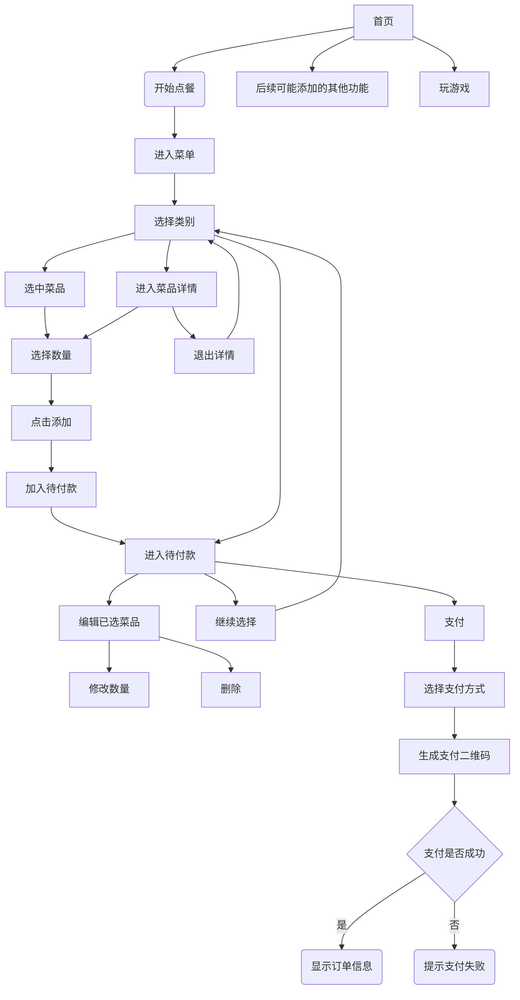

# 点餐流程

```mermaid
graph TD
    首页-->开始点餐(开始点餐)
    开始点餐-->进入菜单
    进入菜单-->选择类别
    选择类别-->选中菜品
    选中菜品-->选择数量
    选择数量-->点击添加
    点击添加-->加入待付款
    加入待付款-->进入待付款
    选择类别-->进入菜品详情
    进入菜品详情-->选择数量
    进入菜品详情-->退出详情
    退出详情-->选择类别
    选择类别-->进入待付款
    进入待付款-->编辑已选菜品
    编辑已选菜品-->修改数量
    编辑已选菜品-->删除
    进入待付款-->继续选择
    继续选择-->选择类别
    进入待付款-->支付
    支付-->选择支付方式
    选择支付方式-->生成支付二维码
    生成支付二维码-->支付是否成功{支付是否成功}
    支付是否成功--是-->显示订单信息(显示订单信息)
    支付是否成功--否-->提示支付失败(提示支付失败)
    首页-->后续可能添加的其他功能
    首页-->玩游戏
```
