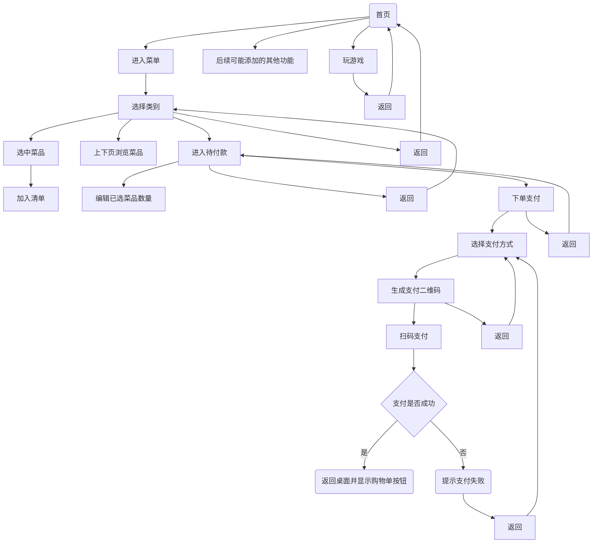

# 点餐流程
根据设计稿修改之前的流程 2017.12.20

```mermaid
graph TD
    首页(首页)-->进入菜单
    进入菜单-->选择类别
    选择类别-->选中菜品
    选择类别-->上下页浏览菜品
    选中菜品-->加入清单
    选择类别-->进入待付款
    选择类别-->从点餐界面返回首页[返回]
    从点餐界面返回首页-->首页
    进入待付款-->编辑已选菜品数量
    进入待付款-->返回继续选择[返回]
    返回继续选择-->选择类别
    进入待付款-->下单支付
    下单支付-->选择支付方式
    下单支付-->返回待付款[返回]
    返回待付款-->进入待付款
    选择支付方式-->生成支付二维码
    生成支付二维码-->扫码支付
    生成支付二维码-->返回选择支付方式[返回]
    返回选择支付方式-->选择支付方式
    扫码支付-->支付是否成功{支付是否成功}
    支付是否成功--是-->显示订单信息(返回桌面并显示购物单按钮)
    支付是否成功--否-->提示支付失败(提示支付失败)
    提示支付失败-->支付失败返回[返回]
    支付失败返回-->选择支付方式
    首页-->后续可能添加的其他功能
    首页-->玩游戏
    玩游戏-->从游戏返回首页[返回]
    从游戏返回首页-->首页
```
