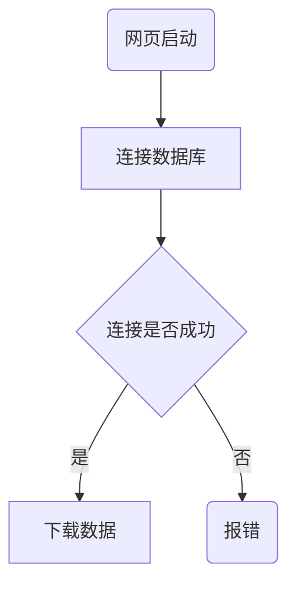
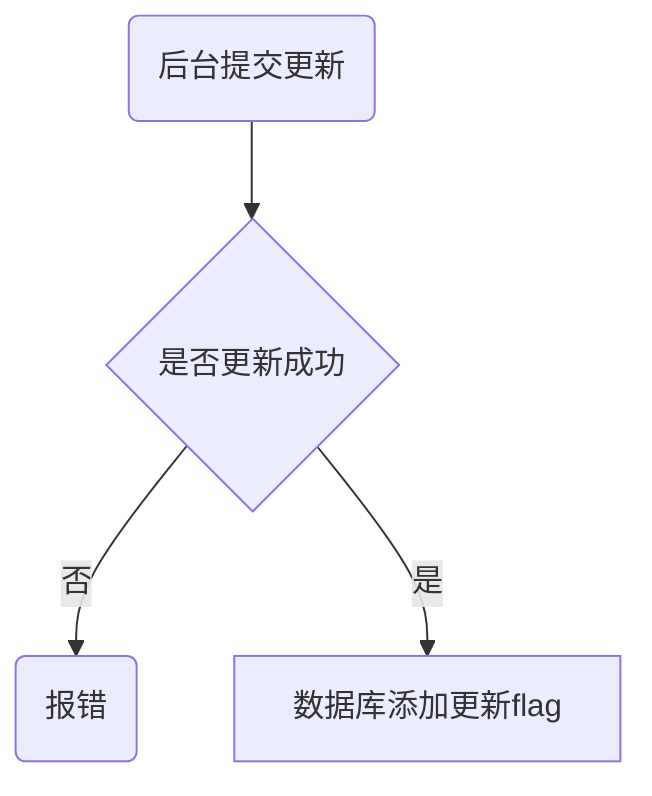
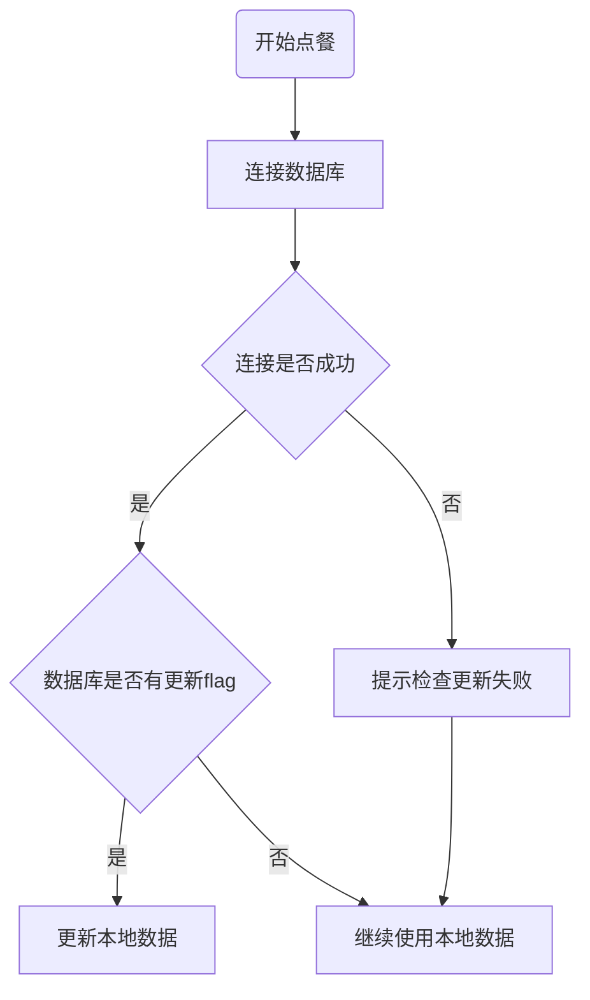

# 数据加载逻辑

## 启动后第一次数据加载

```mermaid
graph TD
    网页启动(网页启动)-->连接数据库
    连接数据库-->连接是否成功{连接是否成功}
    连接是否成功--是-->下载数据
    连接是否成功--否-->报错(报错)
```

## 实时数据更新
### 后台更新

```mermaid
graph TD
    后台提交更新(后台提交更新)-->是否更新成功{是否更新成功}
    是否更新成功--否-->报错(报错)
    是否更新成功--是-->数据库添加更新flag
```

### 前端更新

```mermaid
graph TD
    开始点餐(开始点餐)-->连接数据库
    连接数据库-->连接是否成功{连接是否成功}
    连接是否成功--是-->是否有更新{数据库是否有更新flag}
    连接是否成功--否-->提示检查更新失败
    提示检查更新失败-->继续使用本地数据
    是否有更新--是-->更新本地数据
    是否有更新--否-->继续使用本地数据
```
